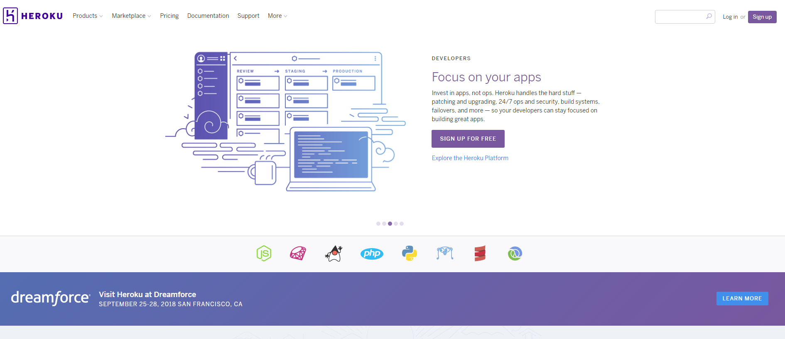
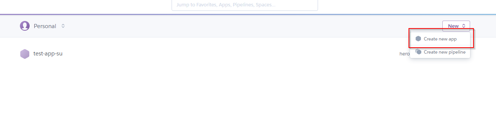
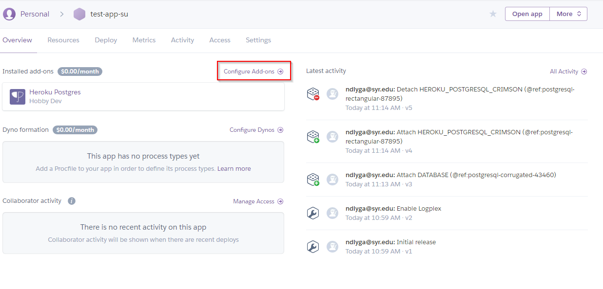
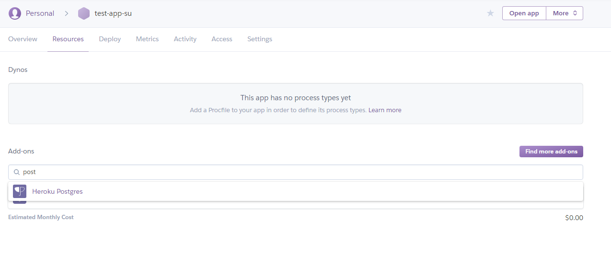
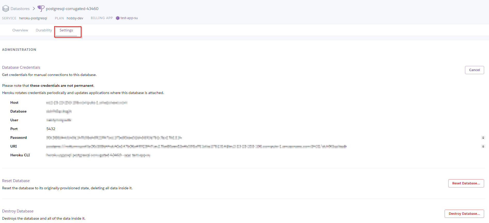
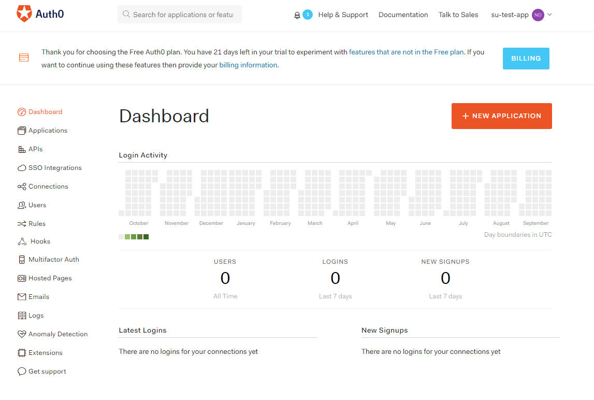
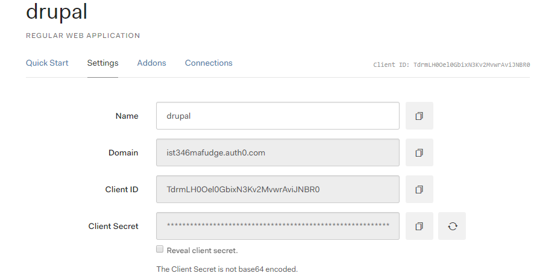
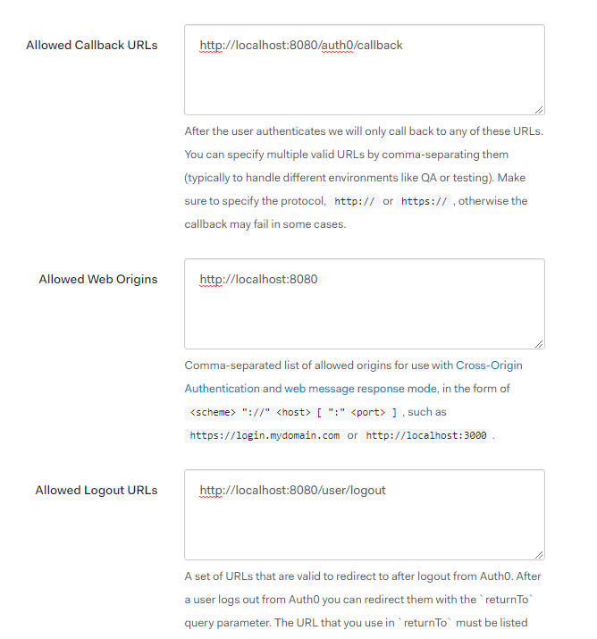
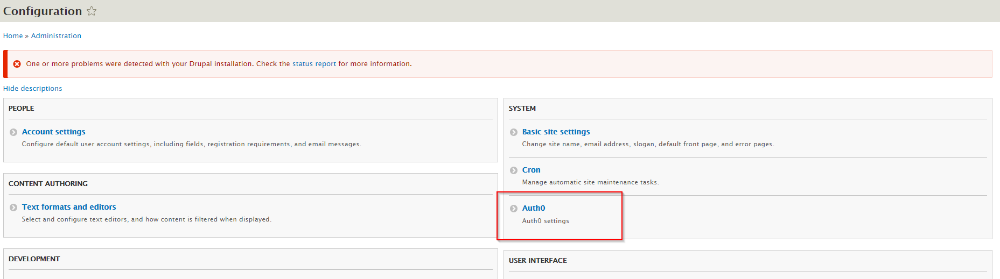

# Lab I - Cloud Computing

In this lab, we will use demonstrate how containerization make it easy to deploy your application to the cloud. We take a web application called Drupal [https://www.drupal.org/](https://www.drupal.org/) and customize it. Once we get it working the way we want we will package up the container into a new image, publish it to Docker Hub, then deploy the image to the cloud where we will run our application. It should give your pretty good insights as to how the DevOps process and Cloud Computing work.


## Learning Objectives

- Install third party authentication plugin for Drupal.
- Demonstrate how to configure authentication as a service using Auth0.
- Learn how to manage changes to Docker containers by placing them into images.
- Understand how docker registry can be used to put images in the cloud
- Discover how to deploy new image to a cloud environment, Heroku [https://www.heroku.com/](https://www.heroku.com/).

## Before you begin 

### Prep your lab environment. 

1. Open the PowerShell Prompt
2. Change the working directory folder to `ist346-labs`  
`PS > cd ist346-labs`
3. IMPORTANT: This lab requires access to Docker's internals, you must enter this command:  
`PS ist346-labs> $Env:COMPOSE_CONVERT_WINDOWS_PATHS=1`
3. Update your git repository to the latest version:  
`PS ist346-labs> git pull origin master`
4. Change the working directory to the `lab-I` folder:  
`PS ist346-labs> cd lab-I`


## Step 1: Create a new Heroku account

Heroku is a cloud provider that utilizes Amazon Web Services to deploy resources. We are using Heroku because they have a very easy to use user interface and offer a very generous free package to developers who are just getting started.

You can sign up for a free account at [https://www.heroku.com/](https://www.heroku.com/)



Once you get access to your free account, and reach the dashboard. Continue on to the next step.

## Step 2: Create a cloud database service

For this lab we are going to create a cloud database service to work with, this will cut down the need to migrate data between your computer and Heroku, which is beyond the scope of this class. The database we will create is a popular open-source relational database called PostgreSQL [https://www.postgresql.org/](https://www.postgresql.org/).

1. If not already, login to Heroku
2. Create a new app to deploy to.

3. Give your new app the name `ist346-netid` for example my app would be `ist346-mafudge`  and click create app.
4. Back at the dashboard, click the name of your new application.
5. Under the app overview, click on configure add-ons

6. On the next screen search for PostgreSQL

7. Click on `Heroku Postgres` and follow the prompt for the free dev version. Click `provision` to create the database.
8. Once the database is created you can click the database under your app's overview tab (see step 5)
9. Click the `settings` tab, then the `view credentials` button and you should see the setting for your database, it will look like the screen below.

10. Copy these settings you will need them to install Drupal in the next steps.

**NOTE: Did you screw up?? No big deal you can reset you database in the same location in the settings. This will clear you database and allow you to start over**

## Step 3: Get Drupal Running Locally.

To get started start the up the Drupal application. Navigate to the lab-I folder in your terminal. Then bring up the drupal container:

`PS ist346-labs\lab-I> docker-compose up -d`

When its finished building the container from the `Dockerfile` you should see:

```
Creating lab-i_drupal_1 ... done
```

Once the container begins to run navigate to the locally running Drupal install [http://localhost:8080](http://localhost:8080)

You will see the setup screen:  

1. Under `Choose Language` Select `English`
2. Under `Choose Profile` Select `Demo: Umami Food Magazine (Experimental)` This will install a sample website for us to use.
3. Under `Setup Database` fill in the options
  a. Select  `PostgreSQL` as the database.
  b. `Database name` should be the `Database` from your Heroku page.
  c. `Database username` should be the `User` from your Heroku page.
  d. `Database password` should be the `Password` your the Heroku page.
  e. Under Advanced Options, the `Host` should be the `Host` your the Heroku page.
4. When you click `Save and Continue` it will take a few minutes as the Drupal system uses the cloud to create your database on the cloud-hosted PostgreSQL service.

**WARNING: BEACUSE WE ARE USING A ==FREE== CLOUD DATABASE SERVICE YOUR WEBSITE WILL BE SLOW!**

15 minutes later (or so....)

5. Next you will be at the screen for configuring the site. 
   a. For the `Site Email Address` enter your own email address.
   b. For `site maintenance account` enter `admin`
   c. For the `password` enter `IST346`
   d. For `default country` select `United States`
   e. For `default time zone` choose `UTC`
   f. click `save and continue` 

After another minute you should see the Umami website we created with Drupal.


## Step 4: Sign up for Auth0

Auth0 is a cloud-based authentication as a service offering. It allows our application to authenticate from a variety of sources, and we will use it to allow users to login to our site with their Google accounts. It is also free to get started and try out. Auth0 uses the OAuth2 authentication protocol to authenticate users. This protocol is used by a variety of vendors such as Facebook, Twitter, Microsoft and Google. You can learn more about [OAuth2](https://oauth.net/2/) on the web. We will use Auth0 to configure Drupal to authenticate users.

1. First create an Auth0 account by heading to the signup page: [https://auth0.com/signup](https://auth0.com/signup).
2. You need to select a `Tenant Domain` for Auth0 for the API endpoints. Enter `ist346netid` for this value. For example my Tenant Domain is `ist346mafudge` then click `Next`.
3. Your `Account Type` should be  `Personal` and your `Role` should be `Non-Developer`. For project select `Just playing around` and click `Create Account` 
2. Once your account is created, you should have access to the dashboard shown below

3. Click the button to create a new application
4. Name your application `drupal`, select `Regular Web Applications` and click `Create`
5. You will now see your new application under `Applications` on your dashboard.
6. Click on the `drupal` application, and click the `settings` tab to view the settings, you will need these later:

7. Enter the urls show below in the correct area:
   a. Allowed Callback URLs `http://localhost:8080/auth0/callback`
   b. Allowed Web Origins `http://localhost:8080`
   c. Allowed Logout URLs `http://localhost:8080/user/logout`




## Step 5: Install the Auth0 Module for your Drupal site

Now that Auth0 is setup we can install the Auth0 drupal module, the module is already installed on the website, but it still needs to be configured 

1. On you drupal site, back at `http://localhost:8080` click the `Extend` button at the top. 
2. Find the newly installed `Auth0` plugin, which is under the heading `OTHER`, and check the box next to it, and click `install`.
3. Once the plugin is enabled, click the `Configuration` button at the top. If everything is correct you should see the Auth0 settings under system (show below)

4. Click on `Auth0` then enter the settings retrieved from Auth0 like below:
   a. For `Client ID` enter the `Client ID` value from the Auth0 website.
   b. For the `Client Secret` enter the `Client Secret` value from the Auth0 website.
   c. For the `Domain` enter the `Domain` from the Auth0 website.
5. Click `Save`
6. Your application should now be using Auth0 for authentication! 

### Lets try it out!

1. Open up another browser where you are not logged into the site and go to the page. [http://localhost:8080/user/login](http://localhost:8080/user/login)
2. Our Drupal site allows us to Log in With Google! Click on the `Login with Google` button.
3. Login with your `g.syr.edu` Google account.
4. You will see an `Authorize App` consent screen which you must accept to complete the process. 
5. Congratulations! You've confirmed Auth0 is setup correctly!


## Step 6: Commit and Push to the Heroku Registry.

Whew!! that was a lot of work, but what happens when I restart my container? EVERYTHING WILL BE GONE! A lot of effort when in to building this site EXACTLY the way we want it. Wouldn't it be nice to save the changes we've made in this container so we can run it in the cloud? That's what we will do next!

1. Create a new image of our Drupal website. Be sure to use the app name you created when you setup Heroku. It should be `ist346-netid` for example my command is:    `docker commit lab-i_drupal_1 registry.heroku.com/ist346-mafudge/web`  
Yours should be:  
`PS ist346-labs\lab-I> docker commit lab-i_drupal_1 registry.heroku.com/ist346-NETID/web` where you replace `NETID` with your netid.

2. The `docker commit` command creates an image from your running container. You can check to make sure the image is there by typing:  
`PS ist346-labs\lab-I> docker images`   
and be on the lookout for `registry.heroku.com/ist346-mafudge/web`

3. Next we need to install the Heroku Command-Line Interface (CLI) on our computer so we can send the image to Heroku. The instructions can be found here:  [https://devcenter.heroku.com/articles/heroku-cli](https://devcenter.heroku.com/articles/heroku-cli)  
When using an ITELL Virtual Machine to do these labs, we should install the 64-bit windows version.
4. After installation completes, you will need to open a new PowerShell window for the software to be recognized.
5. Login to Heroku:
`PS ist346-labs\lab-I> heroku login`  
Enter your Heroku login credentials.
4. Then you need to login to the container registry. A container registry is a cloud service where you can push or pull docker images.
`PS ist346-labs\lab-I> heroku container:login`
5. Once logged in you can push your new image:
`PS ist346-labs\lab-I> docker push registry.heroku.com/ist346-NETID/web` again replace `NETID` with your netid.
6. With the image pushed to Heroku, we can deploy the app!  
First you need to configure our app allow an HTTP server to run in Heroku (Your only need to run this once)  
`PS ist346-labs\lab-I> heroku labs:enable -a ist346-NETID runtime-new-layer-extract` where `NETID` is your netid.  
`PS ist346-labs\lab-I> heroku container:release -a ist346-NETID web` again where `NETID` is your netid.

7. Now see if your application deployed! Go to Heroku [https://dashboard.heroku.com](https://dashboard.heroku.com), click on your application and click the `open app` button in the upper right corner of the screen!  
8. Your website should be https://ist346-NETID.herokuapp.com 

## Step 7: On Your Own

Go back and configure Auth0 so that it supports your Heroku website. The URLs should be similar to the test website except the hostname and port will be different.

## Questions

1. What is the docker command to save the changes in a running container to an image?
1. What is a container registry?
1. What is the docker command to publish a local image to a container registry?
1. What are the advantages of using a service like Auth0?
1. Find another service on the Internet similar to Auth0.
1. All the major cloud providers have a container service similar to Heroku's. What are the names of the Azure, Google and Amazon equivalents of the Heroku container service?